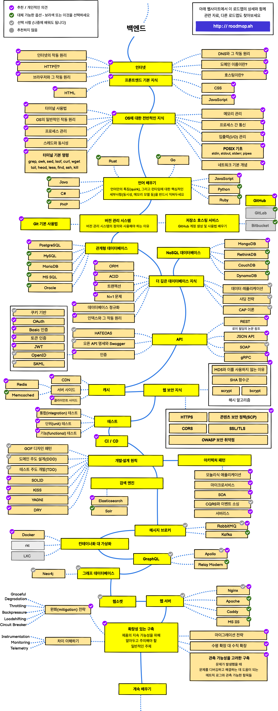

# 백엔드 개발 공부

## 백엔드 로드맵

[전체 로드맵](https://roadmap.sh/)

 

공부할 것

- Java/Kotlin&Spring 기반의 서비스 개발 경험
  - Netty, Spring Mvc, Spring Webflux, Spring Boot, Spring Batch, Spring Cloud Gateway, Spring Cloud Config
- Restful 기반의 서비스 API 설계/구현 경험 (MVC 또는 Reactive framework 기반의 웹 서비스나 API 개발 경험이 있으신 분)
- JPA, Hibernate 등 ORM 사용과 도메인 모델링 경험이 있으신 분
- MySQL(Maria DB) 등의 RDBMS 경험이 있으신 분
- MQ(Kafka, RabbitMQ, ActiveMQ 등) 사용 경험이 있으신 분
  - Kafka (Kafka Stream), Redis, ElasticSearch, Zookeeper 사용 경험이 있는 분
  - Kafka, Memcached, Celery, ELK, Elastic, influxData, Grafana, Redis, Prometheus + Thanos
- jUnit과 테스트코드 작성 라이브러리

- 클라우드 (AWS, GCP, Azure, Alibaba Cloud 등) 기반 서비스 환경에서의 개발 경험
- Docker/Kubernetes 환경에서 시스템 설계 및 운영 경험이 있는 분
  - Docker, Kubernetes + Istio, Haproxy, Nginx
- GoCD, ArgoCD, Consul, Vault, Git, Docker, Spinnaker, Jenkins, Ceph, Harbor  

1. 고가용성의 확장 가능한 시스템을 설계하고 운영해본 경험.
2. 대규모의 실시간 트래픽을 처리하는 시스템을 개발하고 운영하신 경험.
3. Spring Framework와 Kubernetes 기반의 서비스를 운영해본 경험.
4. 성능 최적화와 운영 자동화를 위한 지속적인 노력을 하는 분.
5. 순발력과 빠른 판단을 통한 문제 해결 능력이 있는 분.
6. 변화를 두려워하지 않고 새로운 기술에 빠르게 적응하며 지속적인 성장을 원하는 분.
7. Redis와 Kafka를 사용한 경험이 있으신 분이면 분.
8. JPA와 DB Transaction에 대한 이해도가 높으신 분.
9. 코드 공통화, 업무 자동화를 통해 개발 및 운영 환경을 개선해보신 경험.
10. Spring Framework, Tomcat, JVM, OS, 네트워크, 인프라 등 다양한 레이어에서 트러블슈팅을 할 수 있는 분.
11. Java 애플리케이션의 성능을 튜닝해 본 경험.
12. 자동화된 운영 환경을 구축할 수 있는 개발 능력.
13. 변화를 두려워하지 않고 새로운 기술을 도입하여 서비스와 인프라 환경을 꾸준히 성장.

